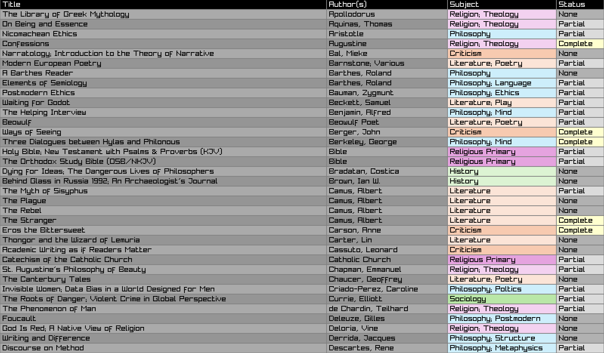

# Library Sorter
---

I maintain an Excel spreadsheet with all the books in my collection ordered so that I can sort them on my shelf, track when I get books, etc. My problem is that Excel's alphabetical sorting is not smart enough (or, probably more likely, I am not smart enough to figure it out) to do a couple special things:

1) Ignore certain words when sorting alphabetically; I want *The Archealogy of Knowledge* under **A**; I want *On Authority and Revelation* also under **A**. Excluding "The," "An," "A," and "On" is what I want from this.
2) Group certain books as a collection. I only have one such case right now (Yukio Mishima's *The Sea of Fertility* tetralogy), but it's important that these books stay together, superseding alphabetization within an author. The group needs to start at the correct alphabetical position of the first book in the tetralogy, continue from there, then resume proper alphabetical ordering.
3) This is a minor nitpick, but in order to properly sort books (by author, then by title), I have to first sort by title, then by author; I keep forgetting to do this. This does not need this done by me.

This program can do everything I need. I'm putting it on Github for my future use, and maybe for others'.

---

### Usage

```terminal
> gcc -o sort main.c
```

Then, run it on some data:
```terminal
> ./sort input.txt output.txt
```

The `input.txt` format is determined by Excel; I export from Excel to tab-delimited .txt file (.csv would have been my preferred choice, but this was easier to parse given that I have a lot of datapoints that contain commas). Modifying this would require modifying `EXPECTED_HEADER`, `EXPECTED_NUMBER_OF_FIELDS`, and probably `get_book_from_line()`, and maybe the `Book` struct and `BookField` enums themselves. The order of the input data shouldn't matter for correctness purposes.

The `output.txt` format is determined by `print_output_and_cleanup_stuff()`; passing a filename that ends with `.html` will automatically output an HTML table. I deliberately squirreled away everything before and after the actual processing of stuff in `main()` into these two (terrible, impure, blah blah blah) functions to make my own maintenance of the program (for the purposes of actually using it) easier. Yes, I could (should) have put all the extra functions and data types and whatnot into a header file, but I also sat down and wrote this in one night, and it does what I want.

You can also run a visualizer that does not send to an output file. You will need [Raylib](https://raylib.com).
```terminal
> gcc -o viewer viewer.c -lraylib
> ./viewer input.txt
```
A sample screenshot:


The `viewer` is configurable to show different amounts of data, and how to color background values. To change what data is shown, modify `COL_WIDTH_PERCENTS`; a `0.0f` means that field won't show. To change the way background values of each field are colored, simply modify the corresponding `colorize_*` function defined at the bottom of the file. 

If you want any help using it or fitting it to your needs, I might be able and willing to if you email me (`wrzeczak@wrzeczak.net`/`wrzeczak@protonmail.com`) or find me on Discord (`wrzeczak`; much less reliable). If I revisit this after creating it, it'll probably to improve its performance, but right now with about 160 books in the collection it runs in no time at all (0.13 seconds is probably way too slow for what I'm actually doing, but for a normal person it doesn't matter at all.)
```terminal
real    0m 0.13s
user    0m 0.00s
sys     0m 0.04s
```